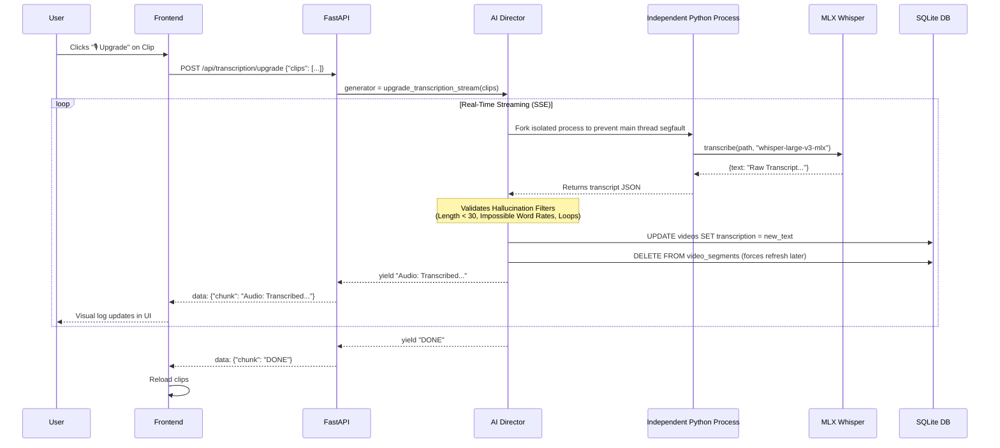
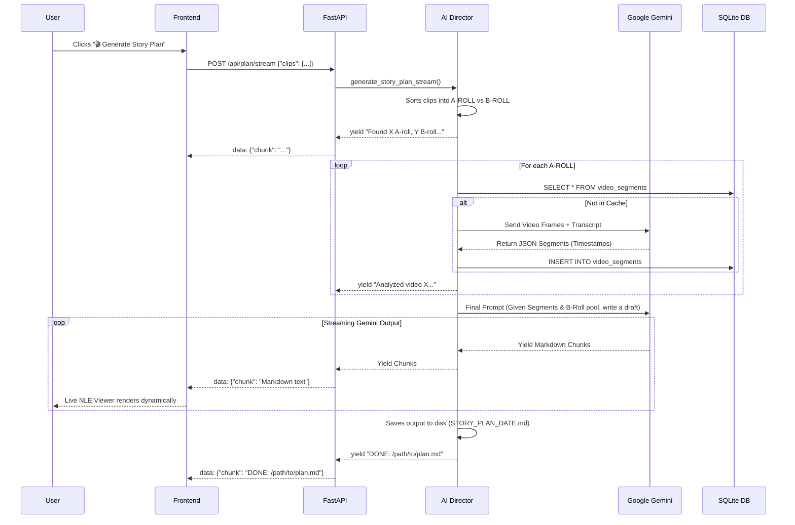

# AI Director Architecture

This document outlines the architecture, main components, and sequence flows of the AI Director application. 

The AI Director is a tool designed to automatically analyze raw video archives, generate "rough cut" story plans using AI, upgrade low-quality transcriptions using advanced models, and finally build polished video outputs.

## General Architecture Overview

The application is split into three main parts:
1.  **Frontend**: A Next.js (React) application serving the AI Studio UI.
2.  **Backend**: A FastAPI server that handles HTTP requests and Server-Sent Events (SSE) for streaming updates.
3.  **Background Processing & AI Core**: Python scripts (`ai_director.py`, `director_engine.py`) orchestrating FFmpeg, `mlx_whisper` for transcription, `google.generativeai` (Gemini SDK) for analysis and story planning, and SQLite for indexing.

---

## Component Diagram

```mermaid
graph TD
    %% Frontend Components
    subgraph Frontend [AI Studio (Next.js/React)]
        UI[Studio Interface]
        NLE[NLE Viewer Component]
        Cal[Calendar Component]
    end

    %% API Gateway / Backend
    subgraph Backend [FastAPI Server]
        SearchRoute[/api/search/]
        PlanRoute[/api/plan/stream]
        BuildRoute[/api/build]
        TranscriptionRoute[/api/transcription/upgrade]
        InsightsRoute[/api/insights]
        VideoRoute[/api/video & /api/thumbnail]
    end

    %% Core Application Logic
    subgraph Core [AI Director Core Layer]
        AI_Director[ai_director.py]
        DirEngine[director_engine.py (Watcher)]
    end

    %% External Services
    subgraph AI_Models [AI Models & Processing]
        Gemini[Google Gemini API]
        Whisper[MLX Whisper Model]
        FFmpegCore[FFmpeg Worker]
    end

    %% Database
    DB[(SQLite: Video_Archive.db)]
    Storage[(Raw Video Archive)]

    %% Connections
    UI <-->|HTTP/JSON| SearchRoute
    UI <-->|SSE Stream| PlanRoute
    UI <-->|SSE Stream| TranscriptionRoute
    UI <-->|SSE Stream| BuildRoute
    UI <-->|HTTP/GET| VideoRoute
    NLE --- UI
    Cal --- UI

    SearchRoute --> AI_Director
    PlanRoute --> AI_Director
    BuildRoute --> AI_Director
    TranscriptionRoute --> AI_Director
    InsightsRoute --> AI_Director
    VideoRoute --> Storage

    DirEngine --> Storage
    DirEngine --> DB
    DirEngine <--> Whisper
    DirEngine <--> Gemini

    AI_Director <--> DB
    AI_Director <--> Gemini
    AI_Director <--> Whisper
    AI_Director --> FFmpegCore
```

---

## Core Components

### 1. The Database (`Video_Archive.db`)
Central source of truth storing three primary tables:
-   `videos`: Stores file path, filename, duration, visual tags (comma-separated), created date, and resolution.
-   `video_search`: Full-Text Search (FTS5) virtual table that indexes the transcriptions for fast keyword searching.
-   `video_segments`: Caches analyzed segment blocks (start/end times, text) processed by the vision model.

### 2. The Ingestion Engine (`director_engine.py --scan-folder`)
Before background processing can occur, videos must be indexed. Running `director_engine.py` with the `--scan-folder <path>` flag performs a recursive scan of the target directory. It extracts exact `duration_sec` and EXIF `creation_time` via `ffprobe`, and safely inserts or self-heals entries in the `videos` table to ensure duplicate-free indexing.

### 3. The Background Watcher (`director_engine.py`)
Running without flags, this script crawls the video archive folder sequentially:
1. Detects new `pending` videos in the SQLite database.
2. Runs FFmpeg to create compressed preview audio.
3. Transcribes the audio locally using `mlx_whisper` (handling Hallucination filters).
4. Runs FFmpeg to extract sequential frames.
5. Sends frames to Gemini 1.5 Pro to generate descriptive `visual_tags` and categorizes the clip as `A-ROLL` (speech) or `B-ROLL` (visuals/action).
6. Updates the database as `completed`.

### 4. The Core API Engine (`ai_director.py`)
Provides the core functionalities requested by the frontend:
-   `get_clips_by_query()`: Queries the FTS5 table and JSON metadata.
-   `get_or_create_segments()`: Validates and caches visual/audio segmentation using Gemini Pro.
-   `generate_story_plan_stream()`: Generates a final Story Plan (NLE JSON format) by pulling `A-ROLL` segments and matching them intelligently with `B-ROLL` overlaps, using Gemini to autonomously craft the storyline directly.
-   `upgrade_transcription_stream()`: Forces a re-transcription using the heavy `whisper-large-v3-mlx` model, isolated in a subprocess to prevent memory segmentation faults, including aggressive hallucination filtering safeguards.
-   `build_vlog_stream()`: Given a generated Story Plan, invokes complex `FFmpeg` filters to construct an `.mp4` video.

Note: The `/api/thumbnail` endpoint implements an MD5 disk cache for FFmpeg frame generation to massively speed up UI rendering during timeline scrubs.

### 4. The Studio Frontend (`page.tsx`)
A Next.js dashboard that lets the user interact with the archive via a unified, search-driven UI. The key interactivity relies heavily on **Server-Sent Events (SSE)**. Operations like *Story Plan Generation*, *Vlog Building*, and *Transcription Upgrades* can take minutes, so the frontend leverages a custom `useSSEStream` React hook to render real-time, animated streaming loaders and debug logs while avoiding blocking timeouts.

---

## Sequence Diagrams

### 1. Upgrading a Transcription



### 2. Generating a Story Plan


